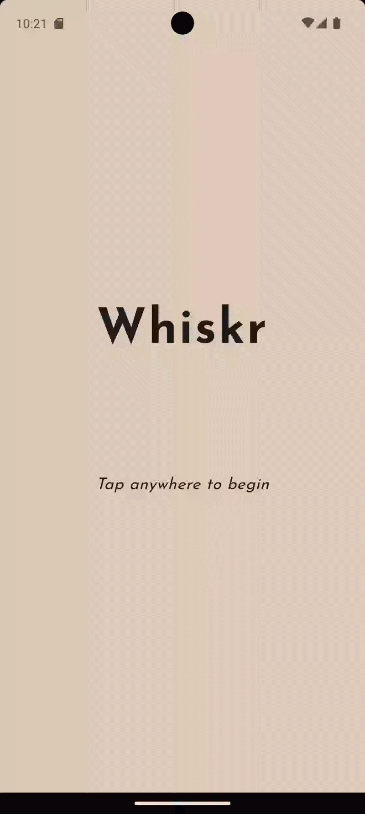
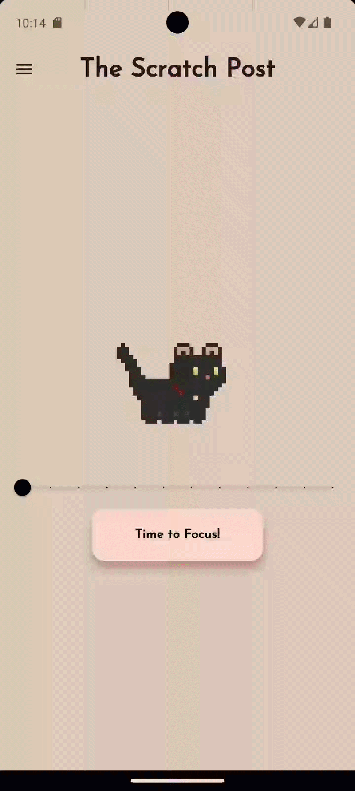

# Whiskr 🐾
**Stay focused, stay productive.**

Whiskr is a minimalist focus timer application built with **Flutter**, designed to help users manage their time effectively using a clean, intuitive interface. 

Built to master the fundamentals of mobile development, Whiskr provides a distraction-free environment to keep you on track—whether you're studying for exams or deep in a coding session.

## 🚀 Features
* **Customizable Focus Timers:** Set your work and break intervals to fit your personal workflow.
* **Sleek UI/UX:** A minimalistic and cat-themed design to make study sessions easy and engaging.
* **Cross-Platform:** Built with Flutter for a seamless experience across mobile and web.
* **Responsive Navigation:** Smooth transitions between the landing page and the active timer.

## 🛠️ Tech Stack
* **Framework:** [Flutter](https://flutter.dev/)
* **Language:** [Dart](https://dart.dev/)
* **Tools:** VS Code, Git

## ⚙️ Technical Implementation

### Native State Management
Whiskr was architected without third-party state management libraries to ensure a lightweight footprint and to demonstrate mastery of Flutter's core lifecycle.

* **`StatefulWidget` & `setState`:** The application leverages Flutter's native state handling to manage UI updates efficiently.
* **Timer Logic:** Implemented using Dart’s `async` library. The timer logic is encapsulated within the widget state, ensuring that UI rebuilds (triggered by `setState`) only occur when necessary to reflect the remaining time.
* **Lifecycle Management:** Special attention was paid to the `dispose()` method to cancel active timers and prevent memory leaks when the user navigates away or closes the app.

## 📸 Preview
**Loading Page** and **Focus Page**
<p align="center">
  
  
  
</p>

## 📦 Installation
To run this project locally, ensure you have the Flutter SDK installed and configured.

1. **Clone the repository:**
   ```bash
   git clone [https://github.com/yourusername/whiskr.git](https://github.com/yourusername/whiskr.git)

2. **Navigate to the project directory:**
    ```bash
    cd whiskr

3. **Install dependencies:**
    ```bash
    flutter pub get

4. **Run the app:**
    ```bash
    flutter run

📝 Project Status
This project is currently in MVP (Minimum Viable Product) status.

Future Improvements
[ ] Add sound notifications for timer completion.

[ ] Implement local storage (SharedPreferences) to save custom timer settings.

[ ] Add a "History" tab to track focus sessions over time.

👤 Author
Hanz Eduardo De Dios Computer Science Student @ CSUF

This project was developed for educational purposes to explore mobile UI/UX and efficient state management in reactive frameworks.